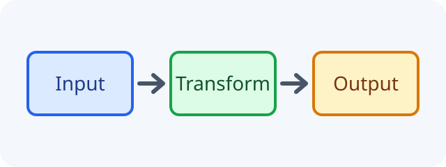
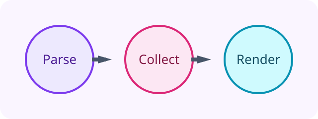

# 画像の検証

<figure class="numbered-figure" id="figure-architecture">
  
  <figcaption>全体構成</figcaption>
</figure>

同一文書内の番号はを期待する。

<figure class="numbered-figure" id="figure-workflow">
  
  <figcaption>処理フロー</figcaption>
</figure>

番号なしの画像を挟んだ後の番号とタイトルはを期待する。

別文書の番号とタイトルはを期待する。
