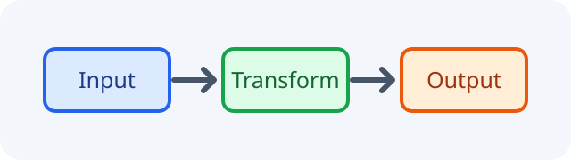

<div class="chapter-start-spacer" aria-hidden="true">&nbsp;</div>

# 別文書 {#chapter-secondary}

第2章でも脚注番号は1から始まる[^chapter-two-note]。

## 参照先 {#section-targets}

<figure class="numbered-figure" id="figure-layout">
  
  <figcaption id="figure-layout-caption">配置構成</figcaption>
</figure>

<figure class="numbered-table" id="table-platforms">

| 環境 | 対応 |
| --- | --- |
| Node.js 22 | 対応 |
| Node.js 24 | 対応 |

<figcaption id="table-platforms-caption">動作環境</figcaption>
</figure>

<figure class="numbered-listing" id="listing-status">
<figcaption id="listing-status-caption">状態を表示する関数</figcaption>

```kotlin
fun showStatus() = println("ready")
```
</figure>

前の文書の見出し参照は<a class="xref-chapter xref-title" href="chapter-one.html#chapter-integration" data-title-href="chapter-one.html#chapter-integration"></a>を期待する。

前の文書の図参照は<a class="xref-figure xref-title" href="chapter-one.html#figure-architecture" data-title-href="chapter-one.html#figure-architecture-caption"></a>を期待する。

前の文書の表参照は<a class="xref-table xref-title" href="chapter-one.html#table-environments" data-title-href="chapter-one.html#table-environments-caption"></a>を期待する。

前の文書のコードリスト参照は<a class="xref-listing xref-title" href="chapter-one.html#listing-greeting" data-title-href="chapter-one.html#listing-greeting-caption"></a>を期待する。

[^chapter-two-note]: 第2章の脚注本文。
